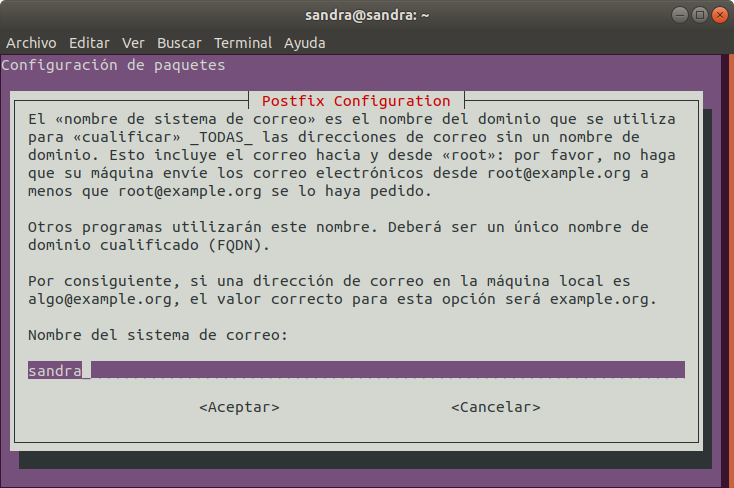
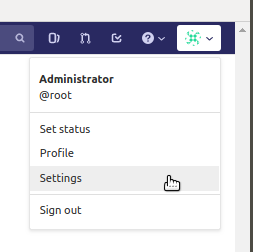
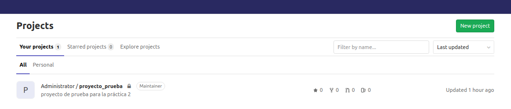
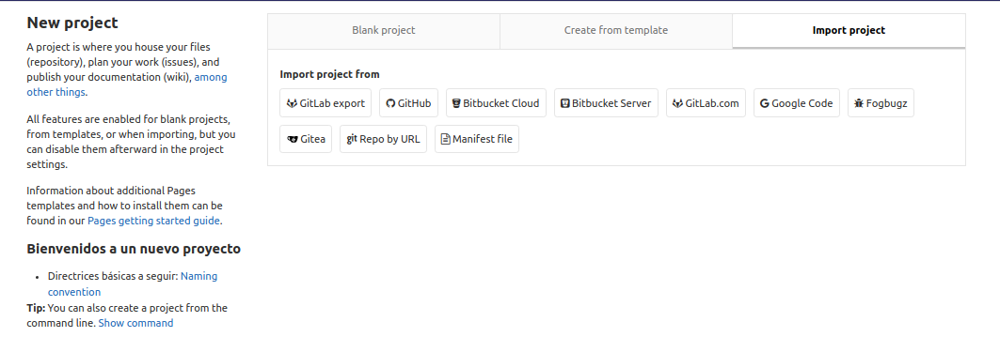
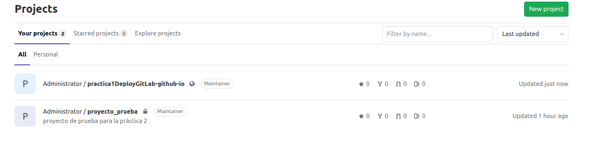

# PRÁCTICA 1. CREAR Y GESTIONAR NUESTRO SERVIDOR DE GITLAB


GitLab es un servicio web de control de versiones y desarrollo de software colaborativo basado en Git. Además de gestor de repositorios, el servicio ofrece también alojamiento de wikis y un sistema de seguimiento de errores, todo ello publicado bajo una Licencia de código abierto.

## Características

- Posee diferentes versiones; _GitLab SAAS_ para empresas y _GitLab Community Edition_ para usuarios.
- Es gratuito, los usuarios pueden tener un número ilimitado de repositorios privados.
- Opera bajo una licencia de código abierto.
- Seguimiento de errores y edición de código basado en la web.
- Integración con LDAP que permite localizar y acceder a diversos recursos de Internet.
- Soporta la importación de Git.


## Objetivo de la práctica

El objetivo de esta práctica es aprender a instalar, utilizar y configurar GitLab de manera local, tanto vía interfaz gráfico como por API. Esto nos permite ampliar nuestros conocimientos en materia de sistemas de control de versiones, proporcionándonos una alternativa más.


# 1. Instalar GitLab en local.

### Paso 1:

- Instalar y configurar las dependencias:

  ```
  sudo apt-get update
  sudo apt-get install -y curl openssh-server ca-certificates
  ```

### Paso 2:

- Instalar Postfix para recibir notificaciones por email:

  ```
  sudo apt-get install -y postfix
  ```

### Paso 3:

- Durante la instalación de Postfix, aparece la siguiente pantalla de configuración:


  


- En la siguiente pantalla, seleccionar _Sitio de Internet_.
  

  


- En la última pantalla, introducir el nombre del sistema de correo que queramos.


  


### Paso 4:

- Añadir el repositorio del paquete de GitLab:

  ```
  curl https://packages.gitlab.com/install/repositories/gitlab/gitlab-ee/script.deb.sh | sudo bash
  ```

### Paso 5:

 Instalar el paquete de GitLab:

- Introducimos la URL y el puerto, a través de los cuales, queremos establecer conexión. Como en nuestro caso lo instalamos localmente, la URL será localhost y elegimos el puerto 4000.

  ```
  sudo EXTERNAL_URL="http://localhost:4000" apt-get install gitlab-ee
  ```

### Paso 6:

- La primera vez, redirecciona a la pantalla de cambio de contraseña.


  


- Una vez cambiada, redirecciona a la pantalla de login. Utilizamos el usuario **root** y la contraseña proporcionada anteriormente para hacer login.


  


- Una vez hecho login, ya tenemos GitLab instalado localmente en nuestro equipo.


  


- A partir de ahora, para acceder a GitLab, introduciremos en nuestro navegador la URL especificada en el paso 5.


  


### Paso 7:

- Modificamos las preferencias de las notificaciones de correo en la siguiente dirección:   
  [https://about.gitlab.com/company/preference-center/](https://about.gitlab.com/company/preference-center/)


## 2. Realizar labores de administración inicial.


### 2.1. Cambiar el puerto de acceso.

Durante la instalación, lo habíamos establecido en el 4000. Lo modificamos de la siguiente forma:

- Accedemos al siguiente fichero desde la terminal:

  ```
  sudo -e /etc/gitlab/gitlab.rb
  ```

- Se abrirá el archivo de ajustes de configuración.


  


- Cambiamos el puerto al que queramos, por ejemplo 5000 y guardamos.

- Para que los cambios se apliquen, tecleamos en la terminal:

  ```
  sudo gitlab-ctl reconfigure
  ```

- Cuando [finaliza](img/captura9.png), ya podemos entrar a GitLab desde la nueva configuración:


  


### 2.2. Impedir que usuarios nuevos puedan modificar su identificador.

- Por defecto, los nuevos usuarios pueden cambiar sus identficadores. Para retirar este privilegio, accedemos al mismo archivo de configuración que en el punto anterior:

  ```
  sudo -e /etc/gitlab/gitlab.rb
  ```

- Y descomentamos la siguiente línea, poniéndola a true:


  


- Para que los cambios se apliquen, tecleamos en la terminal:

  ```
  sudo gitlab-ctl reconfigure
  ```

### 2.3. Modificar el tiempo de expliración de la sesión.

- Entramos a GitLab --> _Admin Area_ --> _Settings_ --> _General_


  


 - Expandimos la opción _Account and limit_ y en _Session duration_, cambiamos los minutos por defecto (10080) a los que queramos.


  


- Guardamos cambios y reiniciamos GitLab desde terminal.

  ```
  sudo gitlab-ctl restart
  ```

## 3. Detallar ejemplos de procesos (vía llamadas a la API).

### 3.1. Alta, modificación y borrado de usuarios.

Las peticiones las realizaremos a través de **Postman**.

- **Alta de usuarios**:

  Sólo pueden crear nuevos usuarios los administradores, por lo que necesitaremos un token con permisos. Para crearlo:

  Accedemos a GitLab y en la configuración de nuestra cuenta de usuario:


  


  En la pestaña _Access Tokens_ creamos nuestro Token rellenando los campos:


  


  Rellenamos los campos en Postman:

  - Método: POST.
  - URL: http://localhost:5000/api/v4/users?private_token=***************
  - Seleccionamos Body, raw, JSON.
  - En _Body_, introducimos los datos del nuevo usuario (sólo los campos _required_ por ser una prueba), al hacer click en Send, lo crea y nos devuelve sus datos:


    


    Si vamos a GitLab -> _Admin Area_ -> _Users_ nos aparecerá el nuevo usuario creado:


    
 

 - **Modificación de usuarios**:

   Como ejemplo vamos a modificar el nombre de usuario, del usuario creado anteriormente:

   En Postman introducimos los siguientes parámetros:

    - Método: PUT.
    - En la ruta, detrás de users introducimos el id del usuario.
    - URL: http://localhost:5000/api/v4/users/2?private_token=*************
    - En _Body_, introducimos los datos a cambiar.
    - Al pulsar send, nos aparecen los datos del usuario ya modificados:


      


 - **Borrado de usuarios**:
  
    Vamos a borrar el usuario creado anteriormente.

    En Postman introducimos los siguientes parámetros:

    - Método: DELETE.
    - En la ruta, detrás de users introducimos el id del usuario.
    - URL: http://localhost:5000/api/v4/users/2?private_token=*************

    


    - Al pulsar send, no aparecerá nada. Podemos verificar que el usuario se ha borrado yendo a _Admin Area_ -> _Users_


    
  

### 3.2. Bloqueo / desbloqueo de usuarios.

- **Bloqueo de usuario**

  En Postman:

  - MÉTODO: POST
  - Tras users colocamos el id del usuario a bloquear + /block
  - URL: http://localhost:5000/api/v4/users/5/block?private_token=**********
  - Devuelve True si todo ha ido bien.

    

  - Podemos comprobar que el usuario no se muestra en el área de usuarios de nuestra cuenta.


 - **Desbloqueo de usuario**

   - Haremos lo mismo que antes pero con la palabra /unblock
   - Nos dará true como resultado.
   - Verificamos que el usuario vuelve a aparecer en el área de usuarios.


### 3.3. Establecer usuario como administrador.

Cuando creamos un usuario, uno de los atributos opcionales es _"admin"_, que por defecto se añade a false. Vamos a modificar este campo de la misma forma que hemos modificado el nombre de usuario en el punto 3.1., vía Postman.

- MÉTODO: PUT
- Tras users, indicamos el id del usuario a modificar.
- URL: http://localhost:5000/api/v4/users/5/?private_token=*********
- En _Body_ indicamos el campo a modificar, al darle a send, nos devolverá el usuario con el campo _"is_admin"_ a true.


  


### 3.4. Creación de proyectos.

 Vía Postman:

 - MÉTODO: POST.
 - Añadimos la palabra clave _projects_.
 - URL: http://localhost:5000/api/v4/projects/?private_token=************
 - En _Body_ añadimos los atributos que queremos incluir, en nuestro caso, añadimos nombre y descripción. Hay muchísimos más, pero el resto, dejamos que se rellenen por defecto y los modificaremos más adelante si los necesitamos.


   
   


 - Si vamos a GitLab, en el apartado _Admin Area_ -> _Projects_, veremos nuestro proyecto creado.


    

 
## 4. Realizar labores de customización.

### 4.1. Modificar la página de creación de un nuevo proyecto.

 - Accedemos a GitLab -> _Admin Area_ -> _Appearance_ -> _New project pages_.
 - Introducimos en el cuadro de texto, la información que queremos añadir a la sección lateral.
 - El texto introducido corresponde al formato [GitLab Flavored Markdown](http://localhost:5000/help/user/markdown).
 

   


 - Vamos a la página de creación de un nuevo proyecto y visualizamos nuestro texto a continuación del texto por defecto.


   


### 4.2. Modificar el logo y la descripción de la pantalla de login.

 - Accedemos a GitLab -> _Admin Area_ -> _Appearance_ -> _Sign in/Sign up pages_.
 - Description: Añadimos una descripción.
 - Logo: Seleccionamos el nuevo logo.


   


 - Observamos el resultado en la pantalla de login:


   


### 4.3. Modificar el favicon de GitLab.

 - Accedemos a GitLab -> _Admin Area_ -> _Appearance_ -> _Favicon_.
 - Seleccionamos el nuevo icono, guardamos.
 - Observamos el icono cambiado en la pestaña del navegador.


   


## 5. Detallar el proceso para poder importar proyectos de GitHub a GitLab por pantalla y por API.

### 5.1. Importar proyecto por pantalla

- Accedemos a GitLab -> New Project.


  


- Import Project -> Seleccionamos el lugar desde donde queremos importar el proyecto. En nuestro caso, GitHub.


  


- Nos pide el Token de GitHub, **vamos a GitHub**, lo creamos y lo añadimos.


  


- **Entre las opciones, seleccionar permisos de repo**

  


- Nos aparecerá una pantalla con todos nuestros proyectos, elegimos el que queremos importar.


  


- Cuando volvemos a la pantalla principal, nuestro proyecto estará añadido a la lista.


  


### 5.2. Importar proyecto por API

Vía Postman:

- MÉTODO: POST.
- URL: http://localhost:5000/api/v4/import/github?private_token=*********
- Añadimos al _Body_:
  - _"personal_access_token"_: El que hemos obtenido en el punto anterior.
  - _"repo_id"_: Nos listamos los repositorio de github con el siguiente _end point_:
    https://api.github.com/users/nombreUsuario/repos, lo que nos proporciona un Id por cada repositorio que tengamos.
  - _"target_namespace"_: El nombre que queramos darle al nuevo repositorio.


    


   - Si accedemos a nuestros proyectos, nos aparece el nuevo repositorio clonado.


     


## 6. Documentación en GitHub Pages

[https://sanesga.github.io/practica1DeployGitLab.github.io/](https://sanesga.github.io/practica1DeployGitLab.github.io/)


